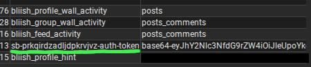

# Bliish Toolbox
Another proof of concept for bliish.com!!!! :3
A simple command line python program made with picks and requests.

## usage
```pip install -r requirements.txt ```

`python main.py`

### how to find your bliish token
The program asks for a user token before you start. This can be found in your browser cookies by using any extension that lets you view them.



If the token is split up into two parts with a .0, and .1 at the end split into two cookies, just join them together in any text editor and keep it to paste into the toolbox.
